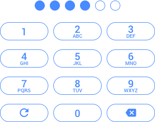

# Ionic Passcode Component

An Ionic Framework Component for creating a Passcode or PIN input.



## Features

* Extremely flexible and easily configurable via HTML attributes
* Extensively themeable with plenty of wrapping markup and CSS hooks
* Can be used stand-alone or as a form control

## Installation

1. Copy the `passcode` folder to `/src/components`

2. Import the Ionic Passcode Component in `/src/app/app.module.ts`

```typescript
import { PasscodeComponent } from '../components/passcode/passcode';
```

3. Add the Ionic Passcode Component to your declarations in `/src/app/app.module.ts`

```typescript
@NgModule({
  declarations: [
    MyApp,
    HomePage,
    PasscodeComponent
    ...
```

4. Start using the Ionic Passcode Component in your views like so:

```xml
<passcode></passcode>
```

## Attributes

The Ionic Passcode Component is easily configurable via HTML attributes. All attributes are optional.

Name                  | Type    | Default | Description
--------------------- | ------- | ------- | -----------
name                  | string  |         | The name attribute value given to the associated hidden form control.
show-backspace-button | boolean | true    | Whether to show the backspace button.
show-clear-button     | boolean | true    | Whether to show the clear button.
show-letters          | boolean | true    | Whether to show letters on the number buttons.
size                  | number  | 4       | The size of the passcode. Must be a number greater than 0.
value                 | number  |         | The current value of the passcode and the value attribute value given to the associated hidden form control.

## Events

Name        | Description
----------- | -----------
changed     | Emitted whenever the passcode is changed.
cleared     | Emitted whenever the passcode is cleared.
completed   | Emitted whenever the passcode is completed.
decremented | Emitted whenever the passcode is decremented.
incremented | Emitted whenever the passcode is incremented.
initialized | Emitted after the component view has been initialized.

## Properties

Name       | Type    | Default | Description
---------- | ------- | ------- | -----------
isComplete | boolean | false   | Whether the passcode has been completed.
length     | number  | 0       | The current length of the passcode.

## Methods

Name      | Arguments      | Returns | Description
--------- | -------------- | ------- | -----------
clear     |                | void    | Clears the passcode and emits the `cleared` event.
decrement |                | void    | Decrements the passcode by one character and emits the `decremented` event.
increment | number: number | void    | Increments the passcode with `number` and emits the `incremented` event.

## Example Usage

The following example assumes you have a Home Page at `/src/pages/home`. If not, just replace home in the example with your page. The example includes:

* Using the available [Attributes](#attributes) to configure the Passcode Component
* How to access all available [Events](#events) emitted by the Passcode Component
* How to call various [Methods](#methods) of the Passcode Component in case you want to create your own controls

1. Update `/src/pages/home/home.ts` with the following:

```typescript
import { Component, ViewChild } from '@angular/core';
import { NavController } from 'ionic-angular';
import { PasscodeComponent } from '../../components/passcode/passcode';

@Component({
  selector: 'page-home',
  templateUrl: 'home.html'
})

export class HomePage {

  @ViewChild(PasscodeComponent) passcodeComponent: PasscodeComponent

  constructor(public navCtrl: NavController) {}

  onPasscodeChanged(passcode): void {
    console.log('Passcode Changed:', passcode);
  }

  onPasscodeCleared(passcode): void {
    console.log('Passcode Cleared:', passcode);
  }

  onPasscodeCompleted(passcode): void {
    console.log('Passcode Completed:', passcode);
  }

  onPasscodeDecremented(passcode): void {
    console.log('Passcode Decremented:', passcode);
  }

  onPasscodeIncremented(passcode): void {
    console.log('Passcode Incremented:', passcode);
  }

  onPasscodeInitialized(passcode): void {
    console.log('Passcode Initialized:', passcode);
  }

  passcodeClear(): void {
    this.passcodeComponent.clear();
  }

  passcodeDecrement(): void {
    this.passcodeComponent.decrement();
  }

  passcodeIncrement(number): void {
    this.passcodeComponent.increment(number);
  }

}
```

2. Update `/src/pages/home/home.html` with the following:

```xml
<ion-header>
  <ion-navbar>
    <ion-title>Passcode</ion-title>
  </ion-navbar>
</ion-header>
<ion-content padding>
  <p text-center>Enter your PIN</p>
  <passcode
    name="user_passcode"
    show-backspace-button="true"
    show-clear-button="true"
    show-letters="true"
    size="6"
    value=""
    (changed)="onPasscodeChanged($event)"
    (cleared)="onPasscodeCleared($event)"
    (completed)="onPasscodeCompleted($event)"
    (decremented)="onPasscodeDecremented($event)"
    (incremented)="onPasscodeIncremented($event)"
    (initialized)="onPasscodeInitialized($event)"
  ></passcode>
  <hr>
  <p text-center>Call some methods...</p>
  <button ion-button block (click)="passcodeClear()">clear()</button>
  <button ion-button block (click)="passcodeDecrement()">decrement()</button>
  <button ion-button block (click)="passcodeIncrement(7)">increment(7)</button>
</ion-content>
```
